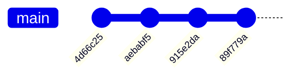
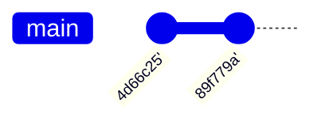

# 10.2 Interaktívny Rebase - Squash

Príkaz `squash` (skratka `s`) spojí commit s tým, ktorý je **priamo nad ním** v zozname (teda so starším,
predchádzajúcim commitom).

## Prečo spájať commity?

Pri bežnej práci často vznikajú drobné commity typu `oprava preklepu`, `este jedna oprava`, `naozaj posledna
oprava`. Tieto commity majú zmysel počas vývoja, ale vo výslednej histórii len robia neporiadok. `squash` ti
umožní spojiť ich do jedného zmysluplného commitu.

## Použitie

```text
pick   4d66c25 Pridanie prihlasovacieho formulára
squash aebabf5 oprava preklepu
squash 915e2da este jedna oprava
pick   89f779a Pridanie testov
```

Pred squashom:



Po squashi:



Commity `aebabf5` a `915e2da` sa zlúčia do commitu `4d66c25`, takže vo výslednej histórii ostanú len 2 commity
namiesto pôvodných 4.

## Úprava výslednej správy

Po uložení zoznamu ti Git ukáže **kombinovanú** commit message zo všetkých zlučovaných commitov a dá ti možnosť ju
upraviť do finálnej podoby:

```text
# This is a combination of 3 commits.
# This is the 1st commit message:

Pridanie prihlasovacieho formulára

# This is the commit message #2:

oprava preklepu

# This is the commit message #3:

este jedna oprava
```

Väčšinou tu vymažeš nepodstatné správy a necháš len tú hlavnú - `Pridanie prihlasovacieho formulára`.

> **Note:** Skratka `fixup` (`f`) funguje rovnako ako `squash`, len **automaticky zahodí** správu zlučovaného
> commitu bez toho, aby sa ťa čokoľvek pýtala - hodí sa, keď vopred vieš, že chceš ponechať iba správu commitu
> vyššie.

> **Dôležité:** Aby si mohol niečo squashnúť do predchádzajúceho commitu, musí byť commit, s ktorým sa spája,
> **vyššie** (staršie) v zozname. `squash` vždy zlučuje smerom "nahor".
