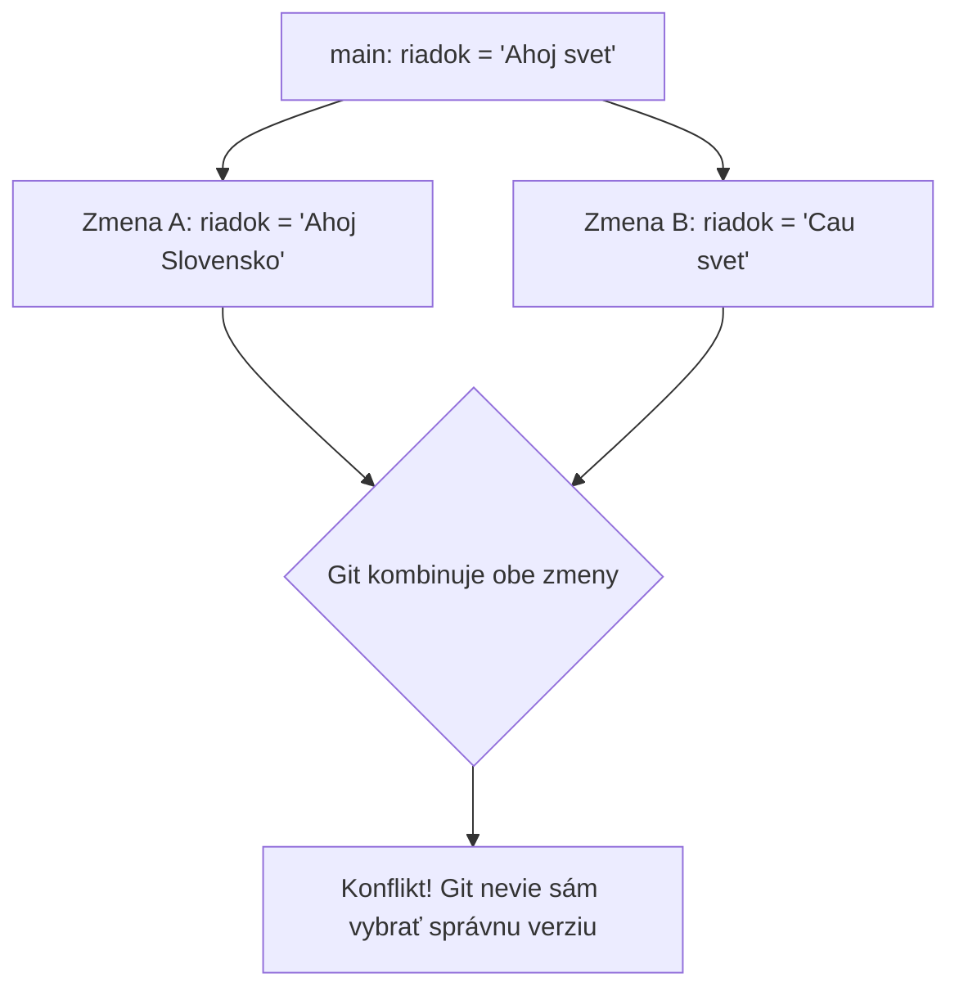

# 11.1 Čo je konflikt?

Doteraz sme predpokladali, že Git vie zmeny vždy bez problémov skombinovať. Niekedy to tak ale nie je - ak sa dve
rôzne verzie súboru líšia **na tom istom mieste**, Git si sám nevie vybrať, ktorú z nich použiť. Tejto situácii
hovoríme **konflikt**.

## Kedy konflikt vzniká

Konflikt nastáva vždy, keď Git kombinuje históriu z dvoch zdrojov (napríklad pri `merge`, alebo - ako uvidíme
v ďalšej lekcii - pri **rebase**) a:

1. oba zdroje menia **ten istý riadok** toho istého súboru rôznym spôsobom, alebo
2. jeden zdroj súbor zmaže, zatiaľ čo druhý ho naďalej upravuje



## Ako vyzerá konflikt v súbore

Keď Git narazí na konflikt, **nevzdá sa** - zapíše do súboru obe verzie oddelené špeciálnymi značkami a rozhodnutie
nechá na tebe:

```text
<<<<<<< HEAD
riadok = "Ahoj Slovensko"
=======
riadok = "Cau svet"
>>>>>>> aebabf5 (Zmena pozdravu)
```

- Všetko medzi `<<<<<<< HEAD` a `=======` je verzia, ktorá je aktuálne u teba (`HEAD`)
- Všetko medzi `=======` a `>>>>>>>` je verzia z commitu, ktorý sa Git snaží skombinovať

> **Dôležité:** Konflikt **nie je chyba** ani niečo, čoho sa treba báť. Je to úplne bežná súčasť práce s Gitom,
> obzvlášť keď na jednom projekte pracuje viacero ľudí súčasne.

## Riešenie konfliktu

Konflikt vyriešiš tak, že súbor ručne upravíš do finálnej podoby - vyberieš jednu z verzií, obe skombinuješ, alebo
napíšeš niečo úplne nové - a **odstrániš** všetky tri značky (`<<<<<<<`, `=======`, `>>>>>>>`).

Napríklad:

```text
riadok = "Ahoj Slovensko"
```

Po úprave súbor označíš ako vyriešený pomocou `git add` a pokračuješ ďalej - ako presne pokračovať pri
interaktívnom rebase, si ukážeme v nasledujúcich dvoch lekciách.

> **Tip:** Väčšina moderných editorov a IDE (napríklad IntelliJ, VS Code) vie konflikty zobraziť prehľadnejšie,
> s tlačidlami "Accept current", "Accept incoming" alebo "Accept both" - nemusíš teda značky mazať úplne ručne.
