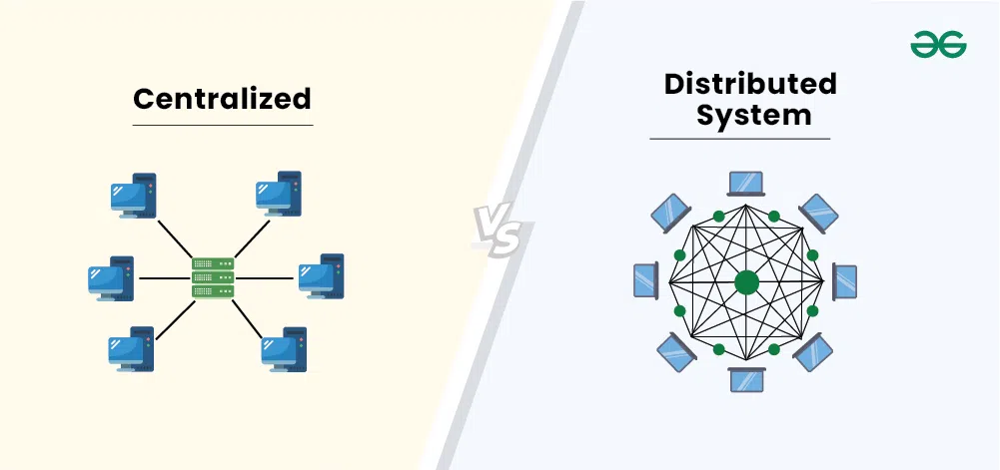

# 12.1 Čo je GitHub?

Doteraz existoval náš repozitár iba na jednom mieste - na tvojom počítači. Jeden z hlavných dôvodov pre vznik Git-u bola
však potreba predovšetkým zdieľať kód medzi viacerými programátormi. Preto si teraz predstavíme koncept vzdialeného
repozitára (tzv. **remote**). Jednou z najznámejších služieb pre zdieľanie Git repozitárov je práve služba **GitHub**.

## Distribuovaný vs. Centralizovaný systém

V prípade VCS (Version Control System) existujú dva hlavné typy:

- **Centralizované**: všetky verzie projektu spravuje len jediný centrálny server. Bez prístupu k tomuto serveru nie je možné verzie projektu nijako spravovať.
- **Distribuované**: každá kópia repozitára obsahuje kompletnú históriu projektu. V tomto prípade server disponuje rovnocennými informáciami ako klient.

**Centralizované** systémy majú výhodu hlavne v jednoduchosti a pre klienta aj v úspore miesta na disku. Tento problém
**Distribuované** systémy nie sú schopné vyriešiť, len minimalizovať. Výhodou **Distribuovaných** systémov je ich
flexibilita a možnosť pracovania bez prístupu k centrálnemu serveru. S Gitom môžem pracovať vo vlaku, alebo si prenášať
repozitár napríklad na USB kľúči, alebo priamo medzi dvoma počítačmi.

## Kde vzdialený repozitár hostovať?

Vzdialený repozitár môžeš hostovať doslova kdekoľvek - na firemnom serveri, na vlastnom počítači, alebo pomocou
špecializovaných služieb, ktoré ti túto starosť zoberú a pridajú aj množstvo užitočných nástrojov navyše (napríklad
prehľadné zobrazenie histórie vo webovom prehliadači, správu úloh, code review a podobne). Medzi najznámejšie, verejne
dostupné, patria **GitHub**, **GitLab** a **Bitbucket**.

V tomto kurze budeme používať práve **GitHub**, keďže je najrozšírenejší a je zadarmo aj pre súkromné (privátne)
repozitáre.

Zaregistrujte sa na [GitHub](https://github.com/) a vytvorte si svoj účet, budeme ho potrebovať pre nasledujúce kapitoly.