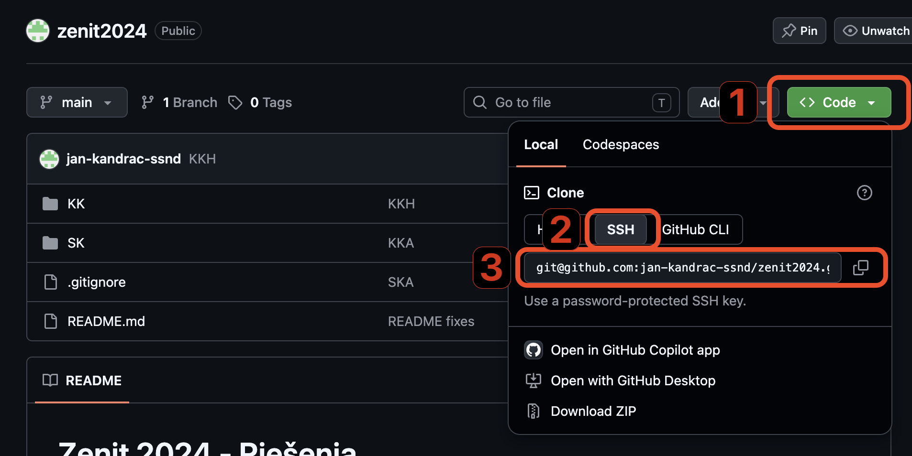

# 12.2 Git Clone

Najprv sa pozrieme na alternatívu, kedy už repozitár existuje a máme k nemu prístupové práva na čítanie. Takým repozitárom
bude akýkoľvek **public** repozitár na GitHub-e.

## Postup pre klonovanie public repozitára

Otvor si stránku s mojimi [riešeniami Zenitu na GitHub-e](https://github.com/jan-kandrac-ssnd/zenit2024)

Na tejto stránke sa môžeš manuálne preklikať v súborovej štruktúre, alebo si celý projekt rovno stiahnuť. Aby si získal
správnu URL na stiahnutie:

1. stlač tlačidlo **Code**
2. zvoľ **SSH** (**HTTPS** sa vyhýbame, lebo nebude použiteľná pri **private** repozitároch)
3. a skopíruj URL adresu

V tomto konkrétnom prípade by to mala byť adresa: `git@github.com:jan-kandrac-ssnd/zenit2024.git`.



Projekt vieš následne, ako repozitár, stiahnuť pomocou príkazu `git clone` nasledovne:

```bash
git clone git@github.com:jan-kandrac-ssnd/zenit2024.git
```

Tento príkaz spraví naraz niekoľko vecí:

1. Vytvorí na tvojom počítači nový priečinok s názvom `zenit2024`
2. Stiahne **kompletnú históriu** repozitára - všetky commity, vetvy aj tagy
3. Nastaví vzdialený repozitár, z ktorého si klonoval, automaticky pod menom **`origin`**
4. Vytvorí (checkoutne) pracovný priečinok s obsahom predvolenej vetvy (najčastejšie `main`)

> **Dôležité:** Po `git clone` máš na svojom počítači plnohodnotnú kópiu repozitára - presne tak, ako sme si
> vysvetlili v predchádzajúcej lekcii o distribuovaných systémoch. Nejde len o stiahnutie aktuálnych súborov, ale
> o stiahnutie **celej histórie**.

Ak chceš zmeniť názov pracovného priečinka napríklad na `moj-vlastny-nazov`, zadaj príkazu `git clone` aj druhý argument:

```bash
git clone git@github.com:jan-kandrac-ssnd/zenit2024.git moj-vlastny-nazov
```
