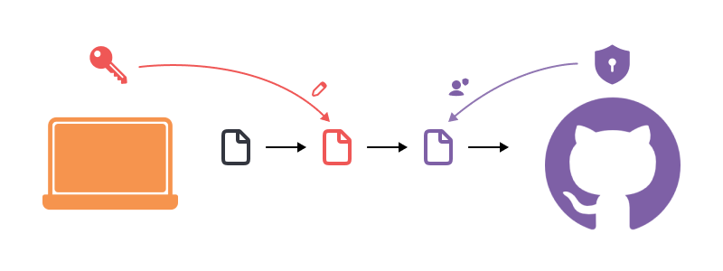

# 13.1 SSH Komunikácia

Teraz nasleduje zložitejší use-case. Chceme presvedčiť GitHub, že:

1. máme právo na čítanie a zápis do/z privátnych repozitárov
2. máme právo na zápis do verejných repozitárov, ako členovia tímu

Predstav si GitHub, ako **colnicu**. Na colnicu si musíš priniesť **pas** pre identifikáciu. A hoci máš pas, v krajine
ťa aj tak nepríjmu, ak nemáš **víza**. Tie si je nutné vybaviť dopredu v danej krajine.

- Víza v tomto príklade reprezentujú **verejný kľúč** (`public key`), ktorým môže disponovať ktokoľvek
- Pas v tomto príklade reprezentuje **privátny kľúč** (`private key`), ktorý zostáva len na tvojom počítači, resp. v tvojom osobnom vlastníctve

## Prečo SSH?

GitHub už dávnejšie zamietol HTTPS komunikáciu, ktorá pri každej operácii vyžadovala od používateľa meno a heslo. Preto
GitHub podporuje už len komunikáciu pomocou SSH/GPG kľúčov.

Oba fungujú na princípe asymetrického šifrovania. Asymetrická šifra vyžaduje dvojicu kľúčov:

- **privátny kľúč** (**private key**) - na obrázku zvýraznený červenou farbou - ním sa údaje z tvojho PC podpíšu, a zostáva len na tvojom počítači
- **verejný kľúč** (**public key**) - na obrázku zvýraznený fialovou farbou - ním sa tvoj podpis overí a zdieľaš ho s každým, komu chceš dovoliť tvoj podpis overiť

Proces pri odoslaní dát je nasledovný:
1. vyžiadaš odoslanie verzie na GitHub
2. tvoj počítať **podpíše** verziu pomocou **privátneho kľúča**
3. GitHub **overí** podpis pomocou **verejného kľúča**
4. po úspešnom overení GitHub vykoná zmeny v zdieľanom repozitári

> **Dôležité:** Na základe verejného kľúča nie je možné zistiť, ako vyzerá privátny kľúč. Preto verejný kľúč môžeš zdieľať s kýmkoľvek.

> **Dôležité:** Ktokoľvek vlastní tvoj privátny kľúč, môže na GitHub-e vykonávať operácie pod tvojim menom. 

