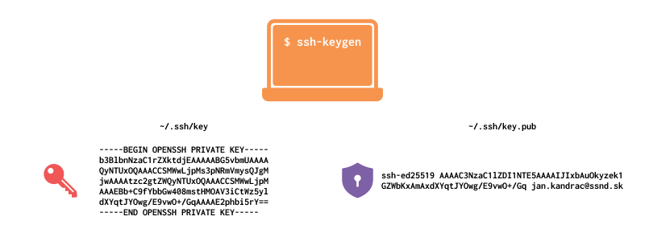

# 13.2 Vytvorenie SSH Kľúčov

Pre generovanie dvojice SSH kľúčov otvor terminál (na Windows Git Bash) a spusť príkaz:

```bash
ssh-keygen -t ed25519 -C "tvoj_email@example.com"
```

- `-t ed25519` určuje **typ** kľúča - `ed25519` je moderný a odporúčaný algoritmus
- `-C "..."` je len komentár (najčastejšie tvoj email), ktorý sa pridá ku koncu verejného kľúča

## Priebeh generovania

Príkaz sa ťa postupne opýta na niekoľko vecí:

1. `Enter file in which to save the key (/home/tvoje-meno/.ssh/id_ed25519):` - kam a pod akým názvom sa má kľúč uložiť.
   Stlačením klávesy <kbd>Enter</kbd> sa uložia kľúče do predvoleného priečinka `~/.ssh/` pod názvom `id_ed25519`. Ak
   chceš dať súboru iný názov, zadaj ho napríklad vo formáte `~/.ssh/moje_kluc`.
2. `Enter passphrase (empty for no passphrase):` - voliteľné dodatočné heslo, obvykle nechávame prázdne. Ak ale pracuješ
   na zdieľanom PC ale sa bojíš, že kľúč môže byť zneužitý, môžeš si ho nastaviť.
3. `Enter same passphrase again:` - znovu zadaj heslo, aby sa uistil, že ho správne zapísal.



Po dokončení nájdeš v priečinku `~/.ssh/` dva nové súbory:

```text
id_ed25519       - privátny kľúč (nikdy nikomu neposielaj)
id_ed25519.pub   - verejný kľúč (tento nahráš na GitHub)
```

## Zobrazenie verejného kľúča

Obsah verejného kľúča si vieš pozrieť klasickým otvorením pomocou textového editora, alebo napríklad príkazom:

```bash
cat ~/.ssh/id_ed25519.pub
```

Výstup bude vyzerať približne takto:

```text
ssh-ed25519 AAAAC3NzaC1lZDI1NTE5AAAAIGV... tvoj_email@example.com
```
Tento kľúč si skopíruj, nahráme ho na GitHub.