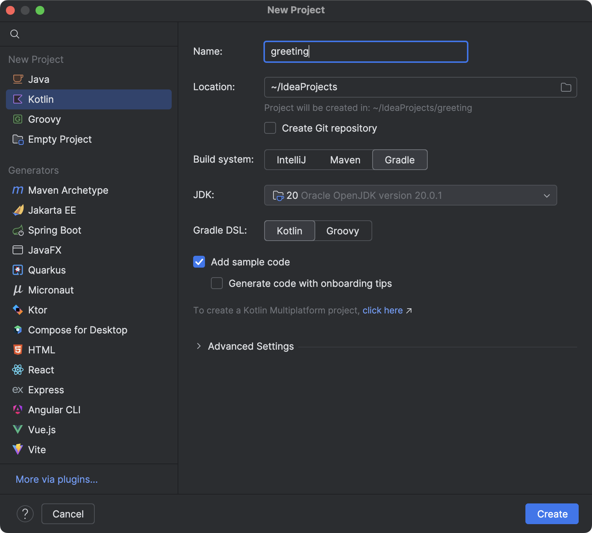

Prvým krokom bude pre nás inštalácia vývojového prostredia. V jazyku Kotlin je možné pracovať v desiatkach prostredí, ale najlepším je dlhodobo IntelliJ Idea. Je to prostredie, ktoré vyvinuli autori jazyka Kotlin.
## IntelliJ Idea

IntelliJ Idea stiahnite zo stránky [JetBrains](https://www.jetbrains.com/idea/download/) alebo zo školského NAS. Inštalácia je priamočiara.

IntelliJ Idea má 2 úrovne. Pre naše potreby nám bude stačiť bezplatná verzia, ale so školským účtom si môžeme aktivovať aj ďalšie funkcionality.

Po nainštalovaní skúste vytvoriť prázdny IntelliJ Idea projekt. V okne *New Project* (pozri screenshot) odporúčam pre začiatok zvoliť:
1. *Name:* Hello World
2. *Location:* domovská zložka
3. *Create Git repository:* off
4. *Build system:* IntelliJ
5. *JDK:* 21
6. *Add sample code:* on

  
