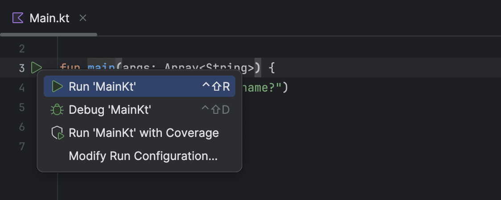

# 1.1 Funkcia main

Akýkoľvek Kotlin kód budeš chcieť napísať, budeš ho musieť vložiť do zložky src. Zložky so zdrojovým kódom sú označené modrou ikonkou. Spustiteľné súbory budú mať príponu .kt a jednu z viacerých možných ikon - úvadzam len niektoré:

| Ikona                                                        | Význam                       |
|--------------------------------------------------------------|------------------------------|
|  src | zložka so zdrojovými súbormi |
|              | Kotlin súbor                 |
|              | Kotlin trieda                |

Kdekoľvek v zložke so zdrojovými súbormi vytvor súbor s príponou *.kt*. Obvykle ho označujeme ako *main.kt*. Jedná sa o Kotlin súbor.
  
V tomto súbore vytvor funkciu main nasledovne  
```kotlin
fun main() {}
```

V IDEA by sa malo vedľa tejto funkcie zobraziť tlačidlo (<span></span>), ktorým tento program môžeš spustiť. Ak sa ti tlačidlo nezobrazí, konzultuj problém s učiteľom.


